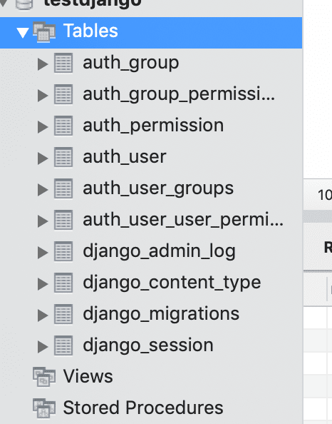

# Django基础

[Django中文网，很详细！](https://docs.djangoproject.com/zh-hans/2.1/)

[Django英文网](https://docs.djangoproject.com/en/2.2/)

- 虚拟环境下，源码路径查看：`~/.virtualenvs/py3django/lib/python3.7/site-packages`
- 项目初始化：`django-admin startproject myDjango`。
- 创建app：`python manage.py startapp my_app`。

## 初见成效

- 安装mysqlclient，并着手配置setting

1. Django建默认表(setting.py配置mysql数据表报错解决)

	```sh
	# DATABASES.default.ENGINE'修改为'django.db.backends.mysql',
	DATABASES = {
			'default': {
					'ENGINE': 'django.db.backends.mysql',
					'NAME': "数据库",
					'USER': "用户名",
					'PASSWORD': "密码",
					'HOST': "IP(127.0.0.1)",
					'PORT': 3306
			}
	}
	# 安装mysqlclient和pymysql
	# 工程目录(manage.py同级的那个)下__init__.py导入
	import pymysql 
	pymysql.install_as_MySQLdb()
	# 将安装目录下//django/db/backends/mysql/base.py以下注释掉
	if version < (1, 3, 13):
			raise ImproperlyConfigured('mysqlclient 1.3.13 or newer is required; you have %s.' % Database.__version__)
	# 将安装目录下//django/db/backends/mysql/operation.py的decode改为encode，py3默认str是unicode编码了，可以encode
	query = query.encode(errors='replace')

	# 创建model或比对记录，会打印 No changes detected。另外可以后跟应用名，注意每个app应在INSTALLED_APPS定义
	python manage.py makemigrations
	# 生成默认数据表，会打印过程：
	python manage.py migrate
	```

	> migration会生成Django默认数据表，如下图；之后module(数据模型)的修改，migration会同步变更数据库。
	

	- 编写业务逻辑：views.py。
	- 配置url路由转换规则：urls.py。
	- 资源文件拆分及管理：HTML与CSS文件分离；CSS文件分离及地址修改。
2. HTML资源路径配置(setting.py)

	`TEMPLATES`中元素的`DIRS`属性，配置html资源路径，这里路径使用`os.path.join(BASE_DIR, 'templates')`，
	像不像webpack。

3. CSS、JS等资源路径配置(setting.py)

	新建配置项属性`STATICFILES_DIRS`，顾名思义，这是个列表。


4. 启动本地服务 `python manage.py runserver`
