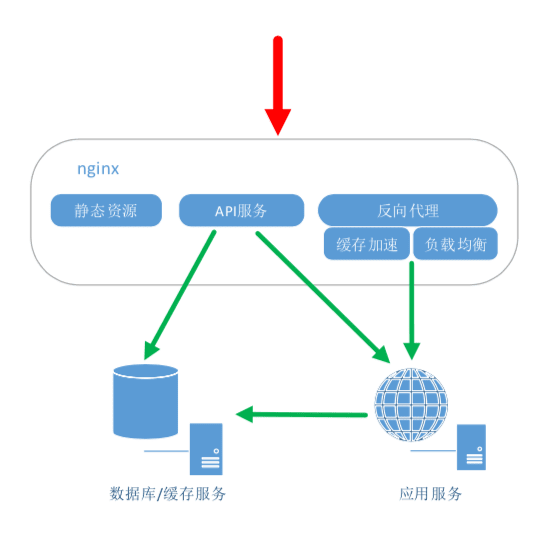

# Nginx初识

[官方网站](http://nginx.org/)

## 主要应用场景

- 静态资源服务：通过本地文件系统提供服务。
- 反向代理服务：Nginx的强大性能；缓存；负载均衡。
  > 正向代理、反向代理？代理的对象不同，分别是客户端和服务端，代理服务器在客户端那边就是正向代理，代理服务器在原始服务器那边就是反向代理。
- API服务：OpenResty。



## 四个主要组成部分

- Nginx二进制可执行文件：由各模块源码编译出的一个文件。
- Nginx.conf配置文件：控制Nginx行为。
- access.log访问日志：记录每一条http请求信息。
- error.log错误日志：定位错误。

## 编译Nginx

1. 下载Nginx

  ``` sh
    # 下载
    wget http://nginx.org/download/nginx-1.16.0.tar.gz
    # 解压缩
    tar -xzf nginx-1.16.0.tar.gz
    cd nginx-1.16.0
  ```

2. 目录简介

  ``` sh
  auto
    cc        # 编译相关
    lib       # lib库
    os        # 操作系统，支持模块
  CHANGES     # 版本新增特性和bugfix
  CHANGES.ru  # 因为作者是俄罗斯人
  conf        # 示例文件
  configure   # 脚本文件，生成中间文件，执行编译前的必备动作
  contrib     # pl脚本和vim工具，如：未做配置时vim编译器没有色彩，执行 cp -r contrib/vim/* ~/.vim (没有目录先新建)
  html        # 默认index页面和50x页面
  man         # 帮助和配置
  src         # Nginx源代码
  LICENSE  
  README
  ```

3. Configure

  ``` sh
  # 查看configure支持参数，中间件如下
  ./configure --help | more
  ```

4. 中间件介绍

- 第一部分：Nginx执行时检索目录作为辅助文件，示例如下：
  - prefix：预设目录
  - modules-path：动态模块
  - lock-path：nginx.lock文件路径
- 第二部分：确认是否使用某些模块
  - with前缀：with前缀的均不会默认编译进Nginx
  - without前缀：without前缀均会默认编译进Nginx
- 第三部分：指定Nginx编译时的特殊参数及添加第三方模块，示例如下：
  - with-cc：设置C编译的路径
  - with-debug：打印debug级别的日志

5. 编译
6. 安装
